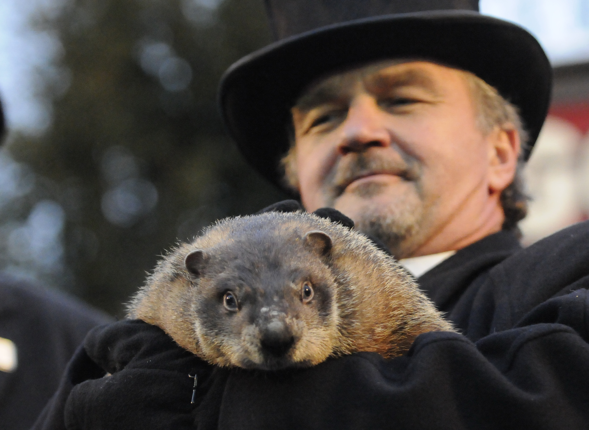

# It's GROUNDHOG DAY!!

  

Ever since I saw Bill Murray's 1993 film *Groundhog Day*, I've been more than a little intrigued by Punxsutawney Phil and his predictions of early spring or 6 more weeks of winter. How could a groundhog possibly know what the weather holds in the near future?

It didn't take much research to corroborate this excerpt from the [Groundhog Day Wikipedia page](https://en.wikipedia.org/wiki/Groundhog_Day):

> According to Groundhog Day organizers, the rodents' forecasts are accurate 75% to 90% of the time.[24] However, a Canadian study for 13 cities in the past 30 to 40 years found that the weather patterns predicted on Groundhog Day were only 37% accurate over that time period.[24] According to the StormFax Weather Almanac and records kept since 1887, Punxsutawney Phil's weather predictions have been correct 39% of the time.[11] The National Climatic Data Center has described the forecasts as "on average, inaccurate" and stated that "[the] groundhog has shown no talent for predicting the arrival of spring, especially in recent years."[25]

   
  Punxsutawney Phil with handler John Griffiths in 2009.

Most other sources seem to confirm that, although entertaining for the masses, Punxsutawney Phil's predictions are not only inaccurate, but are largely subject to the whim of Phil's handler. Here is an excerpt from [Punxsutawney Phil's Wikipedia page](https://en.wikipedia.org/wiki/Punxsutawney_Phil):

> At day break, on February 2, Punxsutawney Phil awakens from his burrow on Gobbler's Knob, is helped to the top of the stump by his handlers, and explains to the President of the Inner Circle, in a language known as "Groundhogese", whether or not he has seen his shadow. The president then interprets Phil's message and directs the Vice President to read the proper scroll.

Nevertheless, I wanted to see if Punxsutawney Phil (or at least his handlers) were at all predictable. Using a Random Forest Classifier and some clever feature engineering, I was able to design and tune a model that predicted Phil's predictions with 82% accuracy. Here's a look at the important features of the model.

  

After all of this, I think my conclusion is this: Groundhog Day is a silly holiday based on American folklore, and it seems mostly an excuse for retired men to dress up in top hats and tuxedos and play with cute animals. I applaud the Punxsutawney Groundhog Club for their continued support and organization of this lighthearted festival each year. I hope you found this little pet project (no pun intended, Phil) entertaining, because I sure did. If you have questions about it or want to get in touch with me, feel free to [email me](mailto:thedavehogue@gmail.com). 

##### Data Sources:
http://www.groundhog.org/about/history/
http://www.groundhog.org/fileadmin/user_upload/siteImages/pdf/Groundhog_Day_Historical_Predictions.pdf
