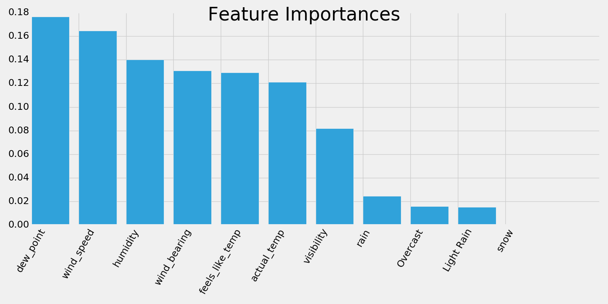

# It's GROUNDHOG DAY!!

  

Ever since I saw Bill Murray's 1993 film *Groundhog Day*, I've been more than a little intrigued by Punxsutawney Phil and his predictions of early spring or 6 more weeks of winter. How could a groundhog possibly know what the weather holds in the near future?

It didn't take much research to more or less confirm this excerpt from the [Groundhog Day Wikipedia page](https://en.wikipedia.org/wiki/Groundhog_Day):

> According to Groundhog Day organizers, the rodents' forecasts are accurate 75% to 90% of the time.[24] However, a Canadian study for 13 cities in the past 30 to 40 years found that the weather patterns predicted on Groundhog Day were only 37% accurate over that time period.[24] According to the StormFax Weather Almanac and records kept since 1887, Punxsutawney Phil's weather predictions have been correct 39% of the time.[11] The National Climatic Data Center has described the forecasts as "on average, inaccurate" and stated that "[the] groundhog has shown no talent for predicting the arrival of spring, especially in recent years."[25]

  

##### Data Sources:
http://www.groundhog.org/about/history/
http://www.groundhog.org/fileadmin/user_upload/siteImages/pdf/Groundhog_Day_Historical_Predictions.pdf
